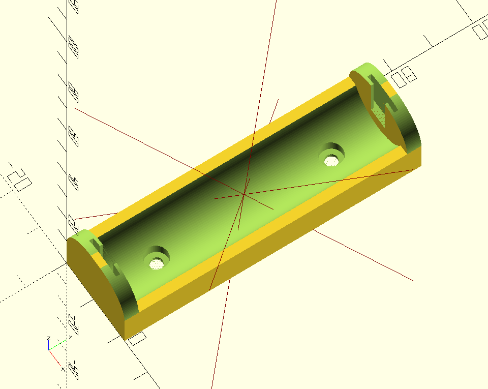

# 18650-holder

OpenSCAD model for an parametric 18650 battery holder with slots for spring contacts.

## dependencies

- [BOSL Libray](https://github.com/revarbat/BOSL)
- [MCAD Library](https://github.com/openscad/MCAD)
